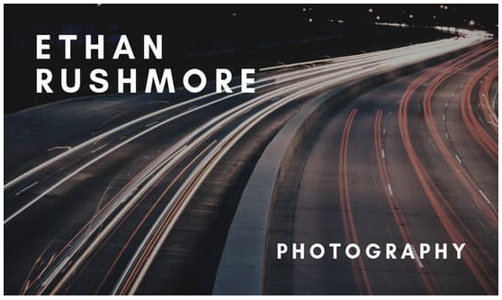
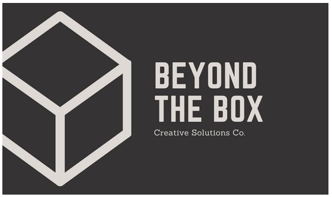
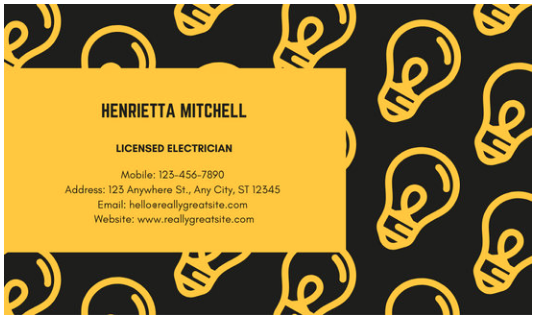
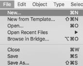

# Create Your Own Business Card Using Adobe Illustrator

## Digital Media Lab Quick Guide
This short guide will get you started with your project. For more information about this or other topics, visit [http://libguides.humboldt.edu/dml](http://libguides.humboldt.edu/dml).

## Description

In this Skillshop we will dive into basic Adobe Illustrator TOOLS AND Design Principles, in order to create our very own Business Card that is ready for print.  

Leave this skillshop better prepared to design a project using Adobe Illustrator, a creative program available to you on select computers on campus, including the Digital Media Lab (LIB 120), the 3rd Floor Computer Lab (LIB 308H) and the checkout laptops. 

*Please keep in mind that the Digital Media Lab has both Mac & PCs, while the 3rd Floor Computer Lab and laptops are PCs only.

## Step 1: Design your card

Decide who is Your Audience and what is your purpose for this Business Card.

Cards can be horizontal (landscape) or vertical (portrait). Which will you choose?

### Some Basic Design Principles
+ [Balance/Composition](https://www.sophia.org/tutorials/design-in-art-balance-and-contrast) -- the visual weight of components in your design. Are they symmetrical? Centered? Are there strong color contrasts? This card uses a photograph of a winding road that passes through the text, using the dark area in the upper left-hand corner for the person's name. 

+ [Emphasis](https://www.sophia.org/tutorials/design-in-art-emphasis-variety-and-unity) -- What will you emphasize and what will you subdue? Will you use color? Size? Will it be the placement of text or shapes? This card for a company named Beyond the Box uses a large box shape on the left-hand side of the card to draw attention to this aspect of their name. 

+ [Scale](https://www.sophia.org/tutorials/design-in-art-scale-and-proportion) -- The size of objects relative to each other and to the size of the card. This card for a piano school looks like a mini piano keyboard and has a very simple but strong branding that this is piano-focused -- it takes up almost the whole card!

+ [Color](https://www.smashingmagazine.com/2010/01/color-theory-for-designers-part-1-the-meaning-of-color/) -- Color theory can be quite complex, but keep in mind how people will view your color choices. Reds and oranges are warmer colors that impart a sense of passion or anger, blues and greens are cooler and calmer. But colors also have cultural connections that you should keep in mind. For example, red is a lucky color in some Asian communities but is strongly associated with sex in some European communities. This card uses yellow and black, two strongly contrasting colors, for an electrician. Yellow is often associated with electricity because we think of lightbulb light as being yellow. 

### Consider your font, graphics, and composition

Free Source Websites to check out: 
Check out various Fonts that are on the Web to Better communicate what your Business Cards emulates.
+ [Dafont.com](https://www.dafont.com/)
+ [Fonts.google.com](https://fonts.google.com/) Google Fonts also gives you some tips on font pairings. You can use a bolder or decorative font for the titles and then simpler clear font for the details.

_Helpful tip on how to download Font for Macs_
+ Once you decide on a font, click download.
+ Then double click the downloaded file in your Finder  > under Downloads
+ Then you will double click the .TTF file and it will download to your fontbook automatically. You may need to restart Illustrator to see your font.

Vector Illustrations are often Created for Illustrator files, Similar to Clip Art but allow for infinite resizing without loss in quality.

+ [Vecteezy.com](https://www.vecteezy.com/)
+ [Pexels.com](https://www.pexels.com/)
+ [Pixabay.com](https://pixabay.com/)

How do you want to compose your design, how much of your canvas do you want to utilize? Maybe a photo image can accompany your information. Maybe a simple line drawing will help accentuate an idea. Search for an image or two and download it to your computer.

Take some time to sketch out on a piece of paper what your basic idea for your card is. Try to think about how you will use one or more of the principles above. 

## Step 2: Create your card
Run the Adobe Illustrator Program, then Begin with a new document that is the size of a business card: 
+ Document size: 3.5” x 2”
+ Bleed: .0125”
+ Image Resolution: 300 dpi

Once you have your new document, start adding content using the tools in the left-hand menu. The Type tool allows you to add text to a document. Once you've added text, you will see the text options at the top of the screen. You can select different font types, sizes and more. The shape tool allows you to add various shapes (right-click or long-click to see shape options other than rectangles).

Add the image you downloaded to your card:
+ Go to File > Place > and locate your image in the Downloads folder (or where you chose to save the image you downloaded). 

## Step 4: Export & ready for Print!

## Quoting
+ Tell your readers from whom and/or what you’re quoting
+ Use a signal phrase or a reporting verb
    + “Tucker argues…”
+ Explain the quote to your readers
+ Avoid drop quoting
    + Introduce your readers to the source.
+ Try making a quote sandwich:

### Example: 
>Having researched cats and social media for years, Tucker (2016) argues that a cat’s “stalking and pouncing is perfect for a six-second Vine or a pithy tweet” (Tucker, 2016).  Because of the seriousness with which cats approach their prey, they are susceptible to humorous juxtapositions.

## Additional Resources 
Research Help Desk: [located on the first floor of the library](http://library.humboldt.edu/about/librarymap.html?y=70&x=145&f=1).

[Purdue’s Online Writing Lab](https://owl.english.purdue.edu/owl/)

Davis, J. P. (2007). [The Rowman and Littlefield guide to writing with sources](https://humboldt-primo.hosted.exlibrisgroup.com/primo-explore/fulldisplay?docid=01CALS_ALMA71401610150002901&context=L&vid=01CALS_HUL&search_scope=01CALS&isFrbr=true&tab=books_csu&lang=en_US). Lanham, MD: Rowman and Littlefield Publishers, Inc.

Graff, G., Birkenstein, C., & Durst, R. (2015). [They say, I say: The moves that matter in academic writing](https://humboldt-primo.hosted.exlibrisgroup.com/primo-explore/fulldisplay?docid=01CALS_ALMA71390912200002901&context=L&vid=01CALS_HUL&search_scope=01CALS&tab=books_csu&lang=en_US). New York, NY: W.W. Norton & Company.

The [HSU Writing Studio](http://learning.humboldt.edu/writing-studio): [located on the first floor of the library](http://library.humboldt.edu/about/librarymap.html?y=3&x=132&f=1). Students can [make appointments online](http://learning.humboldt.edu/writing-studio) or in person at the Learning Center front desk. 

Writing Studio hours for Spring 2018 are: 
+ Mondays & Tuesdays 11:00 am-5:00 pm 
+ Wednesday & Thursday 11:00 am-6:00 pm 
+ Fridays 12:00 pm-4:00 pm 
Drop-ins: 
+ Sunday 7:00-9:00 pm 
+ Wednesday & Thursday 6:00 pm-8:00 pm

---
For more info visit: [http://libguides.humboldt.edu/dml](http://libguides.humboldt.edu/dml) or email dml@humboldt.edu

This guide has an open [Creative Commons license](https://creativecommons.org/share-your-work/licensing-types-examples/). You can use, share, remix and repurpose this content as long as you attribute the author, Lydia Leonard-Rhodes [CC BY](https://creativecommons.org/licenses/by/4.0/), 2018. If you’re re-using this guide, we’d love to hear about your project- dml@humboldt.edu.
